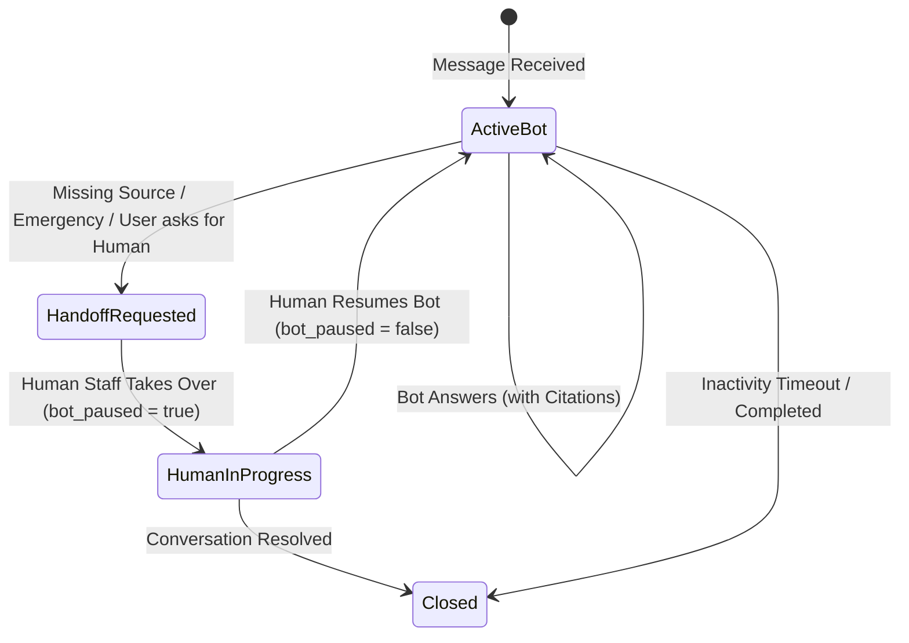
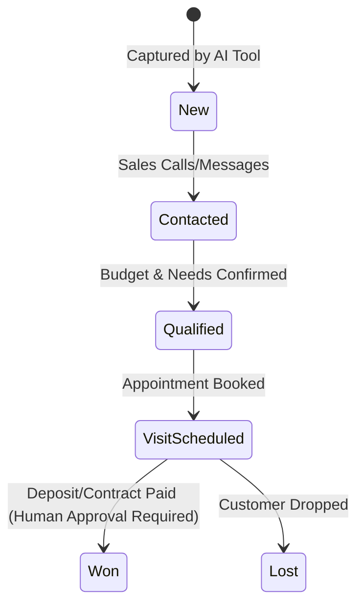

# Chatto Bot: Domain Model & Event Taxonomy Specification

- **Version**: 1.0.0
- **Scope**: Multi-tenant AI Operations SaaS Platform

---

## 1. Domain Entities & Boundaries

### 1.1 Identity & Tenancy Domain (`core`)
- **`Tenant`**: องค์กรหรือธุรกิจผู้เช่าระบบ (e.g. `the-hill-land`, `clinic-alpha`)
  - Fields: `id`, `name`, `slug`, `status` (active/suspended), `created_at`, `settings` (timezone, locale, business_hours)
- **`User`**: สมาชิกทีมงาน (Admin, Sales, Operations, Manager)
  - Fields: `id`, `tenant_id`, `email`, `name`, `role` (`admin` | `sales` | `operations` | `approver`), `status`
- **`Entitlement`**: สิทธิ์การใช้งานตาม Plan
  - Fields: `tenant_id`, `plan_id` (`starter` | `pro` | `enterprise`), `max_agents`, `max_monthly_messages`, `features`

### 1.2 Communications Domain (`crm` & `channel-adapters`)
- **`Contact`**: ผู้สนทนาปลายทาง (ลูกค้าหรือลูกบ้าน)
  - Fields: `id`, `tenant_id`, `channel_type` (`line` | `facebook` | `webchat` | `sandbox`), `channel_user_id`, `display_name`, `phone`, `email`, `created_at`, `updated_at`
- **`Conversation`**: บทสนทนาที่ผูกกับ Contact และ Tenant
  - Fields: `id`, `tenant_id`, `contact_id`, `status` (`active_bot` | `handoff_requested` | `human_in_progress` | `closed`), `assigned_to_user_id`, `bot_paused` (boolean), `last_message_at`, `created_at`
- **`Message`**: ข้อความแต่ละข้อความในบทสนทนา
  - Fields: `id`, `tenant_id`, `conversation_id`, `sender_type` (`customer` | `agent_ai` | `agent_human` | `system`), `content`, `content_type` (`text` | `image` | `action_card`), `citations` (JSON list), `created_at`
- **`InternalNote`**: บันทึกภายในสำหรับพนักงาน
  - Fields: `id`, `tenant_id`, `conversation_id`, `user_id`, `note_content`, `created_at`

### 1.3 Agent Runtime & Knowledge Base Domain (`agent-runtime`)
- **`AgentConfig`**: การตั้งค่าตัวตนและนโยบายของ AI Agent ต่อ Tenant
  - Fields: `id`, `tenant_id`, `name`, `persona`, `model_name`, `temperature`, `system_instructions`, `active_prompt_version`
- **`KnowledgeSource`**: แหล่งข้อมูลความรู้
  - Fields: `id`, `tenant_id`, `title`, `source_type` (`document` | `structured_inventory` | `faq`), `url`, `effective_date`, `version`
- **`KnowledgeChunk`**: ชิ้นส่วนความรู้ที่พร้อมค้นหาและอ้างอิง
  - Fields: `id`, `tenant_id`, `source_id`, `content`, `metadata` (tags, price_ref, zone)
- **`Citation`**: ข้อมูลการอ้างอิงความจริงในคำตอบ
  - Fields: `source_id`, `title`, `snippet`, `effective_date`
- **`ToolDefinition`**: สเปกเครื่องมือที่ AI มีสิทธิ์เรียก
  - Fields: `name`, `description`, `parameters_schema` (JSON Schema), `access_scope` (`read` | `write`), `requires_approval` (boolean)

### 1.4 CRM & Lead Domain (`crm`)
- **`Lead`**: โอกาสทางการขายที่ถูก qualify แล้ว
  - Fields: `id`, `tenant_id`, `contact_id`, `conversation_id`, `source`, `interest_zone`, `budget_min`, `budget_max`, `purpose` (`buy_living` | `investment` | `speculation`), `phone`, `status` (`new` | `contacted` | `qualified` | `visit_scheduled` | `won` | `lost`), `created_at`
- **`Task`**: งานที่ต้องทำต่อสำหรับทีมงาน
  - Fields: `id`, `tenant_id`, `lead_id`, `assignee_user_id`, `due_date`, `action_type`, `status` (`pending` | `completed`)

### 1.5 The Hill Land Vertical Pack (`vertical-packs/the-hill-land`)
- **`PropertyPlot`**: แปลงที่ดิน/ยูนิตในสต็อก
  - Fields: `id`, `tenant_id`, `project_name`, `zone`, `plot_number`, `area_sqm`, `area_rai_ngan_wah`, `price_thb`, `status` (`available` | `on_hold` | `reserved` | `sold`), `price_effective_date`, `features` (วิวเขา, ติดถนน, มีน้ำไฟ)
- **`ServiceTicket`**: ใบแจ้งงานบริการหลังการขายหรือสาธารณูปโภค
  - Fields: `id`, `tenant_id`, `contact_id`, `ticket_number`, `category` (`water` | `electricity` | `road` | `security` | `repair`), `urgency` (`normal` | `high` | `emergency`), `description`, `status` (`open` | `assigned` | `in_progress` | `resolved`), `created_at`

### 1.6 Audit & Analytics Domain (`audit-analytics`)
- **`AuditEvent`**: บันทึกการกระทำสำคัญที่ห้ามแก้ไข (Immutable)
  - Fields: `id`, `tenant_id`, `correlation_id`, `actor_type` (`agent_ai` | `user` | `system`), `actor_id`, `action` (`tool.execute`, `lead.create`, `handoff.request`, `bot.pause`, `price.view`), `resource_type`, `resource_id`, `payload_summary`, `timestamp`
- **`AnalyticsEvent`**: อีเวนต์สำหรับคำนวณ Business Funnel
  - Fields: `id`, `tenant_id`, `event_name` (`funnel.message_received`, `funnel.lead_captured`, `funnel.handoff_triggered`, `funnel.appointment_booked`), `contact_id`, `conversation_id`, `properties`, `timestamp`

---

## 2. State Machines

### 2.1 Conversation Lifecycle

### 2.2 Lead Pipeline

---

## 3. Event Taxonomy

| Event Name | Producer | Description | Payload Key Properties |
|---|---|---|---|
| `channel.message.received` | `channel-adapters` | ได้รับข้อความจากภายนอก | `channel_type`, `message_id`, `sender_id`, `raw_text` |
| `channel.message.deduplicated`| `channel-adapters` | ปฏิเสธข้อความซ้ำ | `channel_type`, `message_id`, `idempotency_key` |
| `conversation.created` | `crm` | สร้าง session การสนทนาใหม่ | `conversation_id`, `contact_id`, `channel_type` |
| `agent.knowledge.retrieved` | `agent-runtime` | ค้นหาและดึงความรู้พร้อม citation | `source_ids`, `query_text`, `chunks_count` |
| `agent.tool.executed` | `agent-runtime` | AI เรียกใช้คำสั่งตามที่ได้รับอนุญาต | `tool_name`, `input_params`, `result_summary`, `idempotency_key` |
| `conversation.handoff.requested` | `operations` | ตรวจพบเงื่อนไขต้องส่งต่อคน | `reason`, `urgency`, `conversation_id` |
| `conversation.bot.paused` | `crm` | บอทหยุดตอบอัตโนมัติ | `conversation_id`, `paused_by` |
| `conversation.bot.resumed` | `crm` | เปิดให้บอทกลับมาช่วยตอบ | `conversation_id`, `resumed_by` |
| `crm.lead.created` | `crm` | สร้าง Lead ลงในระบบสำเร็จ | `lead_id`, `interest_zone`, `budget_min`, `budget_max` |
| `audit.action.logged` | `audit-analytics` | บันทึกประวัติการเปลี่ยนแปลงสำคัญ | `action`, `actor`, `resource_id` |
| `analytics.funnel.recorded` | `audit-analytics` | บันทึกสถานะ conversion ของ funnel | `stage`, `correlation_id` |
